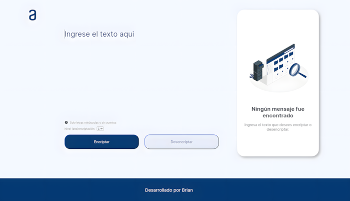
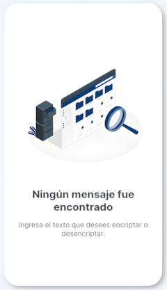
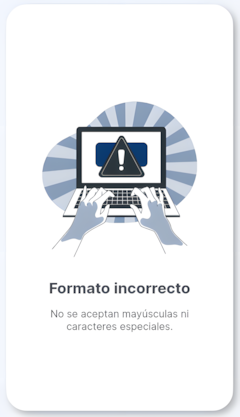
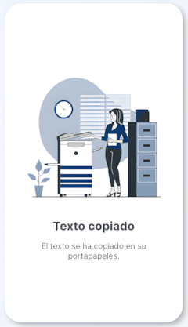

# Encriptador

Este proyecto consiste en una página web que permite encriptar y desencriptar texto. 

## Características

- Encriptación de texto: Permite ingresar texto en minúsculas, sin acentos y sin caracteres especiales, para generar un texto encriptado.
- Desencriptación de texto: Además de encriptar, la página también ofrece la opción de desencriptar texto.
- Nivel de (des)encriptación: Seccionar el nivel de encriptación o desencriptacón, haciendo referencia a la cantidad de veces que se procesa un mismo texto (hay tres niveles).
- Copia al portapapeles: Con un botón, se puede copiar el texto encriptado o desencriptado al portapapeles del usuario.
- Mensajes: La página ofrece unos mensajes para informar al usuario cuando:
   - No se ha ingresado ningún texto.

         
   - Se ingresó un texto que no es válido.

        
   - Se ha copiado el texto al portapales.

      
- Responvidad: El proyecto se adapta a los distintos tamaños de pantallas.

## Uso

1. **Encriptar texto:**
   - Ingresar el texto en el campo designado.
   - Presionar el botón **"Encriptar"**.
   - El texto **encriptado** aparecerá en la interfaz.

2. **Desencriptar texto:**
   - Si se tiene un texto encriptado, ingresarlo en el campo desginado.
   - Presionar el botón **"Desencriptar"**.
   - El texto **desencriptado** aparecerá en la interfaz.

3. **Nivel (des)encriptación:**
   - En el select, seleccionar uno de los tres niveles permitidos, por defecto el nivel 1 es seleccionado.

4. **Copia al portapapeles:**
   - Después de encriptar o desencriptar, presiona el botón **"Copiar"** para copiar el texto al portapapeles.

## Notas adicionales

- El texto ingresado debe cumplir con lo siguiente:
   - **NO** debe haber letras en mayúscula.
   - **NO** debe haber acentos.
   - **NO** debe haber caracteres especiales.
- La encriptación y desencriptación se realizan en el lado del cliente (navegador).

## Tecnologías utilizadas

- `HTML 🏗️`
- `CSS 🎨`
- `JavaScript 💻`

## Demo

[Encriptador texto](https://sbriann.github.io/encriptador-texto/)

## Autor

`Brian Sandoval`

## Recursos usados y/o consultados

- [Ilustraciones - Storyset](https://storyset.com/people)
- [Iconos - MingCute Icon](https://www.mingcute.com/)
- [Tabla unicode](https://symbl.cc/es/unicode-table/)
- [Parámetro global en expresión regular con replace](https://developer.mozilla.org/es/docs/Web/JavaScript/Reference/Global_Objects/String/replace#usando_los_par%C3%A1metros_global_e_ignorecase_con_replace)
- [CSS Grid Layout Module](https://www.w3schools.com/css/css_grid.asp)
- [TextArea](https://developer.mozilla.org/es/docs/Web/HTML/Element/textarea)
- [CSS form](https://www.w3schools.com/css/css_form.asp)
- [Otuline](https://developer.mozilla.org/es/docs/Web/CSS/outline)
- [Placeholder](https://developer.mozilla.org/es/docs/Web/CSS/::placeholder)
- [Selectores CSS](https://developer.mozilla.org/es/docs/Learn/CSS/Building_blocks/Selectors)
- [Flex](https://developer.mozilla.org/es/docs/Web/CSS/flex)
- [Uso de media queries](https://developer.mozilla.org/es/docs/Web/CSS/CSS_media_queries/Using_media_queries)
- [The HTML Select element](https://developer.mozilla.org/en-US/docs/Web/HTML/Element/select)